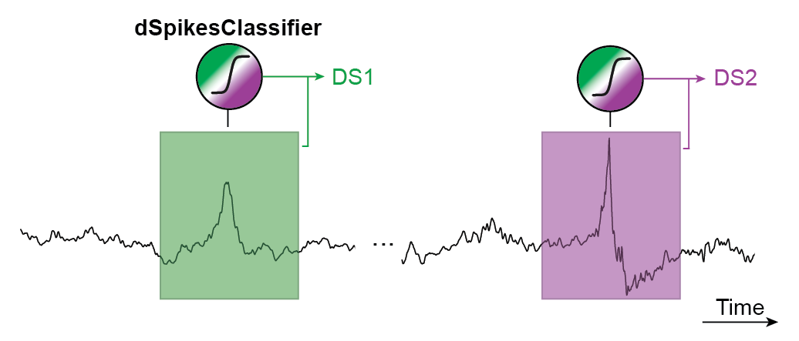

# Dentate Spike Classifier

The code in this directory demonstrates how to predict the type of dentate spikes (i.e., either DS1 or DS2) from the local field potential (LFP) signal recorded from the granule cell layer of the dentate gyrus (DG). This work is highlighted in our latest preprint, McHugh et al. 2023.

This [notebook](dentateSpikeType_prediction.ipynb) illustrates how to use `dSpikesClassifier` to preprocess the LFP signal and classify dentate spikes into either DS1 or DS during an exemplar session.

The data was acquired using a 64-channel silicon probe spanning the somato-dendritic axis of CA1 principal cells and reaching the inferior blade of the DG. LFP signals were sampled at 1250 Hz. Due to storage constraints of this repository, we have uploaded only the LFPs from the granule cell layer channel of the DG and a channel in the stratum oriens, which is used as a reference for detecting dentate spikes. The data is stored in the '/Data/' directory.

Please note that the data shared here is copyrighted to the University of Oxford.

## Getting Started

This repository contains the Dentate Spike Classifier, and to ensure a consistent development environment, we recommend creating a Conda virtual environment using the provided `environment.yml` file.

### Prerequisites
- [Anaconda](https://www.anaconda.com/products/distribution) or [Miniconda](https://docs.conda.io/en/latest/miniconda.html) should be installed on your system.

### Creating the 'dSpikes' Virtual Environment
1. Open a terminal or command prompt.
2. Navigate to the repository's root directory.
3. Create a new Conda virtual environment from the `environment.yml` file using the following command:
``` shell
conda env create -f environment.yml
```
This command will create a virtual environment named "dSpikes".
4. Activate the virtual environment:
``` shell
conda activate dSpikes
```

